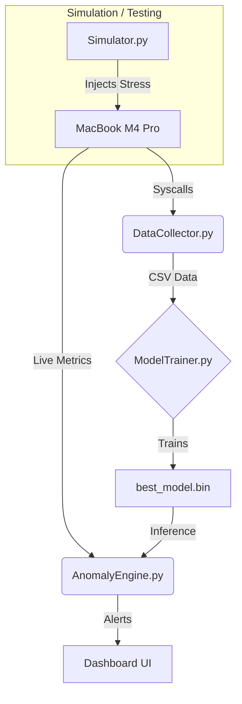

# 🛡️ DCML 2025: Advanced Anomaly Detection System

**Submission for DCML 2025**
*Optimized exclusively for **Apple MacBook Pro M4 Pro**. Support for other architectures is currently in development.*


*(Run `python3 src/AnomalyEngine.py` to see the live dashboard)*

---

## 📖 Project Overview
This project implements a high-performance anomaly detection system designed to identify stress patterns (CPU, RAM, Disk, Network) on Apple Silicon. It features a dual-ecosystem approach: a flexible Python suit for inference and a high-speed C suite for telemetry.

> [!NOTE]
> **Compatibility Warning**: This system uses `mach_host_self` syscalls specific to macOS ARM64. It is **NOT** compatible with Intel Macs, Linux, or Windows at this time.

---

## ⚡ Quick Start (Stable V1)
*This is the production-ready workflow used for the final report.*

### 1. Setup Environment
```bash
python3 -m venv .venv
source .venv/bin/activate
pip install -r requirements.txt
```

### 2. Data Collection
run the standard collector.
```bash
python3 src/DataCollector.py
```
*Output: `src/output_folder/monitored_data.csv`*

### 3. "Extreme Benchmarking" Training
Trains **13+ Algorithms** to find the absolute best model for your specific workflow.
Includes: *Random Forest, Isolation Forest, Neural Networks (MLP), Gradient Boosting, SVM (Linear/RBF), KNN, Naive Bayes, Logistic Regression, LDA, and Local Outlier Factor.*

```bash
python3 src/ModelTrainer.py
```
*Output: `src/best_model.bin` (Results archived in `src/archive/`)*

### 4. Real-Time Dashboard
Launch the protection engine using the Champion Model.
```bash
python3 src/AnomalyEngine.py 15 best
```

> [!TIP]
> **See it in action**: A demo GIF is available at `docs/dashboard_demo.gif`.

---

## 🧪 Experimental (V2 - Beta)
*V2 introduces "Differential Rate Telemetry" to solve long-term drift. It is currently experimental.*

If you wish to test the new engine:
1. Run `python3 src/DataCollector_v2.py` (Captures rates in KB/s)
2. Run `python3 src/ModelTrainer_v2.py` (Trains V2 models)
3. Run `python3 src/AnomalyEngine_v2.py` (V2 Dashboard)

---

## 🏎️ C-Language Hyper-Suite
*Autonomous, zero-dependency monitoring for the M4 Pro.*

The C-Suite runs independently of Python.
```bash
cd src_c
make
./engine --calibrate  # Learn baseline
./engine              # Run Dashboard
```

---

## 📂 Project File Structure
```graphql
DCML_Project/
├── src/                      # 🐍 Python Ecosystem (Stable)
│   ├── AnomalyEngine.py      # MAIN DASHBOARD (V1)
│   ├── DataCollector.py      # Telemetry Collector (Cumulative)
│   ├── ModelTrainer.py       # Model Training (Random Forest)
│   ├── Simulator.py          # Stress Injectors
│   ├── Validator.py          # Verification Script
│   ├── archive/              # Saved Models (.bin)
│   └── analytics/            # Performance Graphs (.png)
│
├── src_c/                    # 🚀 C Hyper-Suite (Native)
│   ├── engine.c              # C Dashboard
│   ├── monitor.c             # Background Logger
│   ├── simulator.c           # Native Load Injector
│   └── telemetry.c           # Mach Kernel Syscalls
│
├── src/experimental/         # 🧪 V2 Ecosystem (Beta)
│   ├── AnomalyEngine_v2.py
│   ├── DataCollector_v2.py
│   └── ModelTrainer_v2.py
│
└── requirements.txt
```

---

## 🔄 System Interaction Graph

How the components talk to each other to protect your Mac:



### How it works
1.  **Simulator**: Injects artificial stress (e.g., occupies 8GB RAM).
2.  **Collector**: Reads hardware counters (CPU ticks, RAM pages).
3.  **Trainer**: Learns what "Stress" looks like vs "Idle".
4.  **Engine**: Watches live data and compares it to the learned model.

---

## 📚 References
1.  **Project Standard**: `DCML 2025 Submission Guidelines`.
2.  **Kernel**: *Mach Kernel Programming Guide* (Apple Inc).
3.  **Algorithm**: *Isolation Forest* (Liu et al, 2008), *Random Forest* (Breiman, 2001).
4.  **Hardware**: *Apple Silicon M4 Pro Architecture Overview*.

---
*Developed by Holan for DCML 2025.*