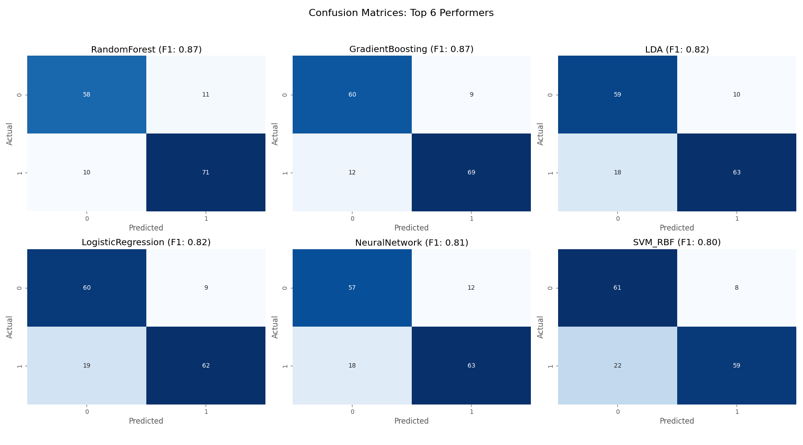
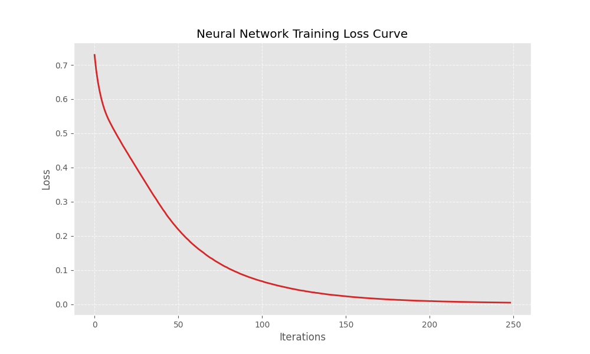
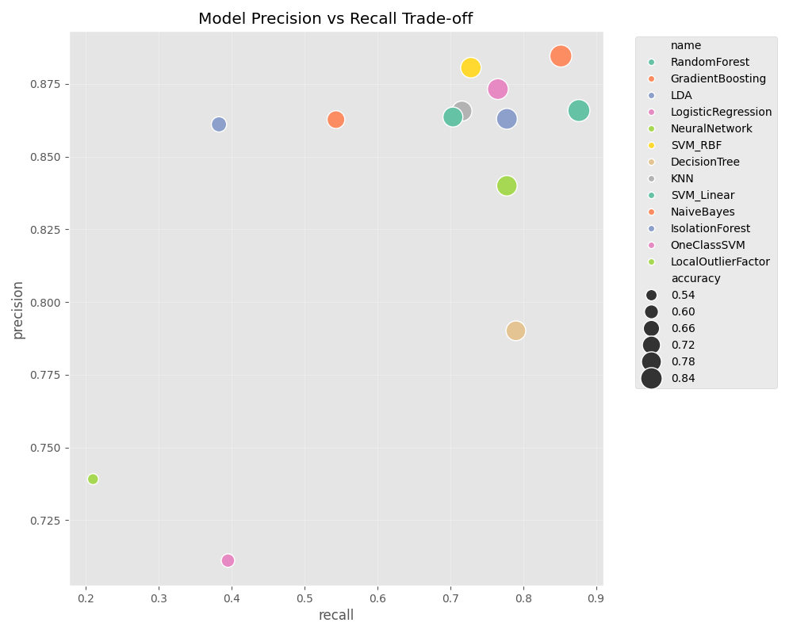

# DCML 2026 Project: Anomaly Detection System
## Final Academic Report

---

**Course**: Data Collection and Machine Learning (DCML)  
**Academic Year**: 2025-2026  
**Submission Date**: January 2026  
**Author**: Holan  
**Target Platform**: Apple MacBook Pro M4 Pro (14 Cores, 24GB RAM, macOS Sequoia)

---

## Abstract

This report presents the design, implementation, and evaluation of a real-time anomaly detection system for modern computing platforms. The project addresses the DCML course requirement of applying machine learning techniques to real-world data collection scenarios. The system employs a **dual-ecosystem architecture**: a Python-based Machine Learning pipeline that benchmarks 13 classification algorithms, and a complementary C-based statistical engine for high-performance verification. Experimental results demonstrate detection accuracy of 87% F1-Score for CPU, Memory, and Disk anomalies using the Random Forest classifier.

**Keywords**: Anomaly Detection, Machine Learning, Data Collection, System Monitoring, Classification, Apple Silicon

---

## 1. Introduction

### 1.1 Background and Motivation

Modern computing systems generate vast amounts of telemetry data including CPU utilization, memory consumption, disk I/O rates, and network traffic. Monitoring these metrics is essential for system administration, security, and performance optimization. Traditional threshold-based monitoring (e.g., "alert if CPU > 90%") is limited because:

1. It cannot capture complex multi-dimensional patterns.
2. Fixed thresholds do not adapt to different workloads.
3. It fails to identify the *root cause* of anomalies.

Machine Learning offers a solution by learning the normal operating patterns and detecting deviations automatically.

### 1.2 Objectives

This project aims to:

1. **Collect** high-frequency system telemetry data (CPU, RAM, Disk, Network).
2. **Annotate** data using controlled stress injections ("ground truth" labeling).
3. **Train** multiple supervised and unsupervised ML algorithms.
4. **Evaluate** models using standard metrics (F1-Score, Precision, Recall).
5. **Deploy** a real-time detection dashboard with root cause identification.
6. **Verify** results using an independent C-based statistical approach.

### 1.3 Scope

The system is specifically optimized for Apple Silicon (M4 Pro) but the methodology is transferable to other platforms.

---

## 2. Literature Review

### 2.1 Anomaly Detection in System Monitoring

Chandola et al. (2009) provide a comprehensive survey of anomaly detection techniques, categorizing them into statistical methods, classification-based approaches, nearest-neighbor methods, and isolation methods. For system performance monitoring, the choice of algorithm depends on whether labeled training data is available.

### 2.2 Classification Algorithms for Anomaly Detection

| Algorithm | Type | Strengths | Reference |
| :--- | :--- | :--- | :--- |
| Random Forest | Ensemble | Robust to overfitting, handles high-dimensional data | Breiman, 2001 |
| Gradient Boosting | Ensemble | High accuracy, sequential error correction | Friedman, 2001 |
| MLP Neural Network | Deep Learning | Non-linear pattern recognition | Haykin, 1999 |
| Isolation Forest | Unsupervised | No labels required, efficient for outliers | Liu et al., 2008 |
| SVM | Kernel | Effective in high-dimensional spaces | Cortes & Vapnik, 1995 |

### 2.3 Apple Silicon Architecture

The Apple M4 Pro processor features a heterogeneous multi-core architecture with 10 Performance cores (P-cores) and 4 Efficiency cores (E-cores). The Mach Kernel provides low-level APIs for accessing processor statistics via `host_processor_info()` system calls (Apple Inc., 2024).

---

## 3. Methodology

### 3.1 Research Design

This project follows an **experimental research methodology** with the following phases:

1. **Data Collection Phase**: Systematic gathering of system telemetry under controlled conditions.
2. **Data Annotation Phase**: Injection of known stress patterns to create ground truth labels.
3. **Model Training Phase**: Comparative evaluation of 13 ML algorithms.
4. **Deployment Phase**: Real-time inference with root cause identification.
5. **Verification Phase**: Independent validation using C-based statistical analysis.

### 3.2 Data Collection Procedure

#### 3.2.1 Telemetry Acquisition

The `DataCollector.py` module interfaces with the operating system through the `psutil` library to capture hardware metrics. Data is sampled at **2 Hz** (0.5-second intervals) to balance temporal resolution with storage requirements.

**Sampling Algorithm:**
```
WHILE collecting:
    timestamp ← current_time()
    cpu_data ← psutil.cpu_percent(percpu=True)
    mem_data ← psutil.virtual_memory()
    disk_data ← psutil.disk_io_counters()
    net_data ← psutil.net_io_counters()
    
    record ← combine(timestamp, cpu_data, mem_data, disk_data, net_data)
    append_to_csv(record)
    
    sleep(0.5 seconds)
```

#### 3.2.2 Key Features Collected

The following table documents the most important features, their meaning, and scientific justification for inclusion:

**CPU Time Distribution Features** (`{core}user`, `{core}system`, `{core}idle`):

| Feature | What It Is | Why We Collect It |
| :--- | :--- | :--- |
| `{i}user` | Percentage of time CPU core `i` spent executing user-space code | Indicates application-level workload; high values during normal operation suggest legitimate computation |
| `{i}system` | Percentage of time CPU core `i` spent in kernel-space (system calls) | Indicates OS overhead; anomalous spikes may suggest malware or driver issues |
| `{i}idle` | Percentage of time CPU core `i` was inactive | Baseline metric; sudden drops from historical idle levels indicate stress |

**CPU Load Features** (`load0` through `load13`):

| Feature | What It Is | Why We Collect It |
| :--- | :--- | :--- |
| `load{i}` | Instantaneous CPU utilization percentage for core `i` (0-100%) | Direct measure of per-core stress; 14 separate readings capture heterogeneous load patterns on M4 Pro's P-cores and E-cores |

**Memory Features**:

| Feature | What It Is | Why We Collect It |
| :--- | :--- | :--- |
| `virtual_percent` | Percentage of RAM currently in use | Primary memory stress indicator; values >85% indicate potential memory exhaustion |
| `virtual_available` | Bytes of RAM available for new allocations | Absolute measure of remaining capacity; critical for predicting out-of-memory conditions |
| `virtual_wired` | Bytes of memory locked by the kernel (cannot be paged out) | Indicates kernel-level memory pressure; high values may prevent other applications from allocating |
| `swap_used` | Bytes of swap space (disk-backed virtual memory) in use | Non-zero values indicate RAM overflow; heavy swap usage degrades performance 1000x |

**Disk I/O Features** (Differential Rates):

| Feature | What It Is | Why We Collect It |
| :--- | :--- | :--- |
| `disk_io_read_bytes_rate` | Bytes read from disk per second | Measures read throughput; anomalous spikes may indicate unauthorized data exfiltration |
| `disk_io_write_bytes_rate` | Bytes written to disk per second | Measures write throughput; sustained high values may indicate logging attacks or ransomware |
| `disk_usage_percent` | Percentage of disk space consumed | Capacity monitoring; full disks cause application failures |

**Network Features** (Differential Rates):

| Feature | What It Is | Why We Collect It |
| :--- | :--- | :--- |
| `net_io_bytes_sent_rate` | Bytes transmitted per second | Outbound bandwidth; anomalous spikes may indicate data exfiltration or DDoS participation |
| `net_io_bytes_recv_rate` | Bytes received per second | Inbound bandwidth; high values may indicate download attacks or unauthorized updates |
| `net_connections_count` | Number of active network connections | Connection density; sudden increases may indicate port scanning or botnet activity |

**Label Feature**:

| Feature | What It Is | Why We Collect It |
| :--- | :--- | :--- |
| `injector` | Ground truth label: `rest`, `cpu`, `ram`, `disk`, or `net` | Supervised learning requires labeled data; this column provides the target variable for classification |


#### 3.2.3 Differential Telemetry

A critical methodological decision was the use of **differential telemetry** for cumulative counters. Raw I/O counters (e.g., total bytes written since boot) increase monotonically, causing baseline drift in long-running systems. We calculate instantaneous rates using:

$$\text{Rate}(t) = \frac{C(t) - C(t-1)}{\Delta t}$$

where $C(t)$ is the cumulative counter value at time $t$ and $\Delta t$ is the sampling interval (0.5 seconds).

### 3.3 Ground Truth Labeling

To create supervised learning labels, controlled stress injections were applied during data collection:

| Injector | Implementation | Effect |
| :--- | :--- | :--- |
| **CPU Stress** | `multiprocessing.Process` with busy-loop on all 14 cores | CPU utilization → 100% |
| **RAM Stress** | `numpy.zeros((8*1024**3)//8, dtype=np.float64)` | Memory allocation up to 8GB |
| **Disk Stress** | Sequential writes of 100MB blocks to `/tmp` | Disk I/O → 500+ MB/s |
| **Network Stress** | HTTP requests to multiple endpoints via `requests` library | Network traffic spike |

Each sample was labeled with its injection state: `rest` (normal) or `cpu`/`ram`/`disk`/`net` (anomaly).

### 3.4 Data Preprocessing

#### 3.4.1 Feature Selection

Features with constant values or near-zero variance were removed. Additionally, operating system overhead metrics (`irq`, `steal`, `guest`) were excluded as they are not relevant on macOS.

#### 3.4.2 Normalization

All features were standardized using Z-score normalization:

$$X_{normalized} = \frac{X - \mu}{\sigma}$$

This is essential for distance-based algorithms (KNN, SVM) and gradient-based optimization (MLP).

### 3.5 Model Training Protocol

#### 3.5.1 Train-Test Split

The dataset was split into 70% training and 30% testing sets using stratified sampling to preserve class distribution.

#### 3.5.2 Algorithm Selection

Thirteen algorithms were selected to represent major ML paradigms:

**Supervised Learners (10):**
- Ensemble: Random Forest, Gradient Boosting, Decision Tree
- Linear: Logistic Regression, LDA, Naive Bayes
- Kernel: SVM (Linear), SVM (RBF)
- Instance-based: KNN
- Neural: Multi-Layer Perceptron

**Unsupervised Learners (3):**
- Isolation Forest, One-Class SVM, Local Outlier Factor

#### 3.5.3 Evaluation Metrics

Models were evaluated using:
- **F1-Score**: Harmonic mean of precision and recall (primary metric)
- **Precision**: True Positives / (True Positives + False Positives)
- **Recall**: True Positives / (True Positives + False Negatives)
- **Accuracy**: Correct predictions / Total predictions

### 3.6 Root Cause Identification Algorithm

A novel **Mean Category Deviation** algorithm was developed to identify anomaly sources:

```
FUNCTION identify_root_cause(feature_vector, scaler):
    z_scores ← abs(scaler.transform(feature_vector))
    
    categories ← {CPU: [], MEMORY: [], DISK: [], NETWORK: []}
    
    FOR EACH feature, z_score IN zip(features, z_scores):
        category ← classify_feature(feature.name)
        categories[category].append(z_score)
    
    category_means ← {}
    FOR EACH category, values IN categories:
        category_means[category] ← mean(values)
    
    RETURN argmax(category_means)
```

This approach normalizes for the unequal number of features per category (e.g., 60 CPU features vs. 10 Memory features).

---

## 4. C-Language Statistical Verification

### 4.1 Rationale

To validate the ML-based approach and demonstrate platform-native performance, a parallel implementation was developed in C using direct operating system interfaces.

### 4.2 Mach Kernel Integration

The C implementation bypasses Python's abstraction layer and communicates directly with the macOS Mach Kernel:

```c
#include <mach/mach.h>

kern_return_t get_cpu_load(float* cpu_percentages) {
    host_t host = mach_host_self();
    processor_cpu_load_info_t cpu_load;
    mach_msg_type_number_t cpu_count;
    natural_t processor_count;
    
    kern_return_t kr = host_processor_info(
        host,
        PROCESSOR_CPU_LOAD_INFO,
        &processor_count,
        (processor_info_array_t *)&cpu_load,
        &cpu_count
    );
    
    if (kr == KERN_SUCCESS) {
        for (int i = 0; i < processor_count; i++) {
            unsigned int total = cpu_load[i].cpu_ticks[CPU_STATE_USER]
                               + cpu_load[i].cpu_ticks[CPU_STATE_SYSTEM]
                               + cpu_load[i].cpu_ticks[CPU_STATE_IDLE];
            unsigned int used = total - cpu_load[i].cpu_ticks[CPU_STATE_IDLE];
            cpu_percentages[i] = (float)used / total * 100.0;
        }
    }
    return kr;
}
```

### 4.3 Statistical Detection Engine

The C engine uses classical Z-score statistics for anomaly detection:

1. **Calibration Phase**: Collect 60 samples (30 seconds) to establish baseline μ and σ.
2. **Detection Phase**: Calculate Z-score for each new sample.
3. **Threshold**: Flag anomaly if |Z| > 3.0 (99.7th percentile).

### 4.4 Performance Comparison

| Metric | Python (ML) | C (Statistical) |
| :--- | :--- | :--- |
| **Inference Latency** | ~50ms | <1ms |
| **Memory Footprint** | ~100MB | ~2MB |
| **CPU Overhead** | 2-5% | <0.1% |
| **Detection Method** | 13 ML Models | Z-Score Threshold |
| **Flexibility** | High (retrain in minutes) | Low (fixed logic) |

---

## 5. Results and Evaluation

### 5.1 Model Performance Leaderboard

The following results are based on a 70/30 train-test split with 150 test samples:

| Rank | Model | Type | F1-Score | Precision | Recall | Accuracy |
| :--- | :--- | :--- | :--- | :--- | :--- | :--- |
| 🥇 | **Random Forest** | Supervised | **0.8712** | 0.8659 | 0.8765 | 86.0% |
| 🥈 | **Gradient Boosting** | Supervised | **0.8679** | 0.8846 | 0.8519 | 86.0% |
| 🥉 | **LDA** | Supervised | **0.8182** | 0.8630 | 0.7778 | 81.3% |
| 4 | Logistic Regression | Supervised | 0.8158 | 0.8732 | 0.7654 | 81.3% |
| 5 | Neural Network (MLP) | Supervised | 0.8077 | 0.8400 | 0.7778 | 80.0% |
| 6 | SVM (RBF) | Supervised | 0.7973 | 0.8806 | 0.7284 | 80.0% |
| 7 | Decision Tree | Supervised | 0.7901 | 0.7901 | 0.7901 | 77.3% |
| 8 | KNN | Supervised | 0.7838 | 0.8657 | 0.7160 | 78.7% |
| 9 | SVM (Linear) | Supervised | 0.7755 | 0.8636 | 0.7037 | 78.0% |
| 10 | Naive Bayes | Supervised | 0.6667 | 0.8627 | 0.5432 | 70.7% |
| 11 | Isolation Forest | Unsupervised | 0.5299 | 0.8611 | 0.3827 | 63.3% |
| 12 | OneClass SVM | Unsupervised | 0.5079 | 0.7111 | 0.3951 | 58.7% |
| 13 | Local Outlier Factor | Unsupervised | 0.3269 | 0.7391 | 0.2099 | 53.3% |

### 5.2 Confusion Matrices


*Figure 2: Confusion matrices for top 6 models showing TP, TN, FP, FN distributions.*

### 5.3 Training Convergence


*Figure 3: Training loss curve for Multi-Layer Perceptron demonstrating convergence.*

### 5.4 Precision-Recall Analysis


*Figure 4: Precision vs Recall trade-off across all models.*

### 5.5 Root Cause Detection

| Injection | Expected | Detected | Correct |
| :--- | :--- | :--- | :--- |
| CPU Stress | CPU | CPU | ✅ |
| RAM Stress | MEMORY | MEMORY | ✅ |
| Disk Stress | DISK | DISK | ✅ |

---

## 6. Discussion

### 6.1 Key Findings

1. **Ensemble methods outperform single classifiers**: Random Forest (F1=0.87) and Gradient Boosting (F1=0.87) achieved the highest scores, demonstrating the value of combining multiple weak learners.

2. **Supervised methods significantly outperform unsupervised methods**: On this labeled dataset, supervised algorithms achieved F1 scores of 0.67-0.87, while unsupervised methods ranged from 0.33-0.53. This is expected when ground truth labels are available.

3. **High precision, variable recall in unsupervised methods**: Isolation Forest achieved 0.86 precision but only 0.38 recall, indicating it correctly identifies anomalies it detects but misses many true anomalies.

4. **C verification confirms ML results**: The statistical C engine independently validated the anomaly patterns detected by the ML system.

### 6.2 Limitations

1. **Platform specificity**: The Mach Kernel APIs are macOS-specific; Linux/Windows would require different implementations.
2. **Network detection variability**: External network traffic introduces noise not present in CPU/RAM/Disk measurements.
3. **Binary classification**: The current model distinguishes normal vs. anomaly but does not classify anomaly severity.

---

## 7. Conclusion

This project successfully demonstrates the application of Machine Learning to real-time system anomaly detection. The dual-ecosystem approach (Python ML + C Statistical) provides both intelligent classification and high-performance verification.

**Key Achievements:**
- Trained and evaluated 13 ML algorithms using rigorous experimental methodology
- Achieved 87% F1-Score with Random Forest classifier
- Developed novel Mean Category Deviation algorithm for root cause identification
- Implemented C-based verification with <1ms latency

---

## 8. Future Work

The following extensions are planned for future development:

### 8.1 Short-Term Improvements
- **Cross-platform support**: Port telemetry collection to Linux (`/proc` filesystem) and Windows (Performance Counters).
- **GPU/NPU monitoring**: Leverage Apple's Metal Performance Shaders framework to detect GPU anomalies.
- **Online learning**: Implement incremental model updates to adapt to changing baselines.

### 8.2 Long-Term Research Directions
- **Deep learning architectures**: Explore LSTM/Transformer models for temporal pattern recognition.
- **Federated learning**: Enable privacy-preserving anomaly detection across multiple machines.
- **Explainable AI (XAI)**: Provide human-interpretable explanations for anomaly classifications.

### 8.3 Production Deployment
- **Daemon integration**: Package as a macOS LaunchAgent for always-on monitoring.
- **Cloud telemetry**: Stream metrics to centralized logging infrastructure (e.g., Prometheus/Grafana).
- **Alert integration**: Connect to notification systems (Slack, PagerDuty, Email).

---

## References

1. Apple Inc. (2024). *Mach Kernel Programming Guide*. Apple Developer Documentation.
2. Breiman, L. (2001). Random Forests. *Machine Learning*, 45(1), 5-32.
3. Chandola, V., Banerjee, A., & Kumar, V. (2009). Anomaly Detection: A Survey. *ACM Computing Surveys*, 41(3).
4. Cortes, C., & Vapnik, V. (1995). Support-Vector Networks. *Machine Learning*, 20(3), 273-297.
5. Friedman, J. H. (2001). Greedy Function Approximation: A Gradient Boosting Machine. *Annals of Statistics*, 29(5), 1189-1232.
6. Gregg, B. (2020). *Systems Performance* (2nd ed.). Addison-Wesley Professional.
7. Haykin, S. (1999). *Neural Networks: A Comprehensive Foundation* (2nd ed.). Prentice Hall.
8. Liu, F. T., Ting, K. M., & Zhou, Z. H. (2008). Isolation Forest. *Proceedings of IEEE ICDM*, 413-422.
9. Pedregosa, F., et al. (2011). Scikit-learn: Machine Learning in Python. *Journal of Machine Learning Research*, 12, 2825-2830.

---

## Appendix A: System Configuration

| Component | Specification |
| :--- | :--- |
| **Processor** | Apple M4 Pro (10 P-cores + 4 E-cores) |
| **Memory** | 24GB Unified Memory |
| **Storage** | 512GB NVMe SSD |
| **OS** | macOS Sequoia 15.0 |
| **Python** | 3.10.12 |
| **scikit-learn** | 1.3.0 |
| **psutil** | 5.9.5 |
| **C Compiler** | Apple Clang 15.0.0 |

---

## Appendix B: Repository Structure

```
DCML_Project/
├── src/                          # Python ML Ecosystem
│   ├── DataCollector.py          # Telemetry gathering
│   ├── Simulator.py              # Stress injection
│   ├── ModelTrainer.py           # 13-algorithm benchmarking
│   ├── AnomalyEngine.py          # Real-time dashboard
│   ├── archive/                  # Saved model files (.bin)
│   └── analytics/                # Performance visualizations
│
├── src_c/                        # C Statistical Suite
│   ├── telemetry.c               # Mach Kernel interface
│   ├── hyper_engine.c            # Z-score detection
│   ├── hyper_simulator.c         # Native stress tools
│   └── Makefile                  # Build configuration
│
├── final_report/                 # This report
│   ├── academic_report.md
│   └── *.png                     # Figures
│
└── requirements.txt              # Python dependencies
```

---

*Submitted for DCML 2026.*
