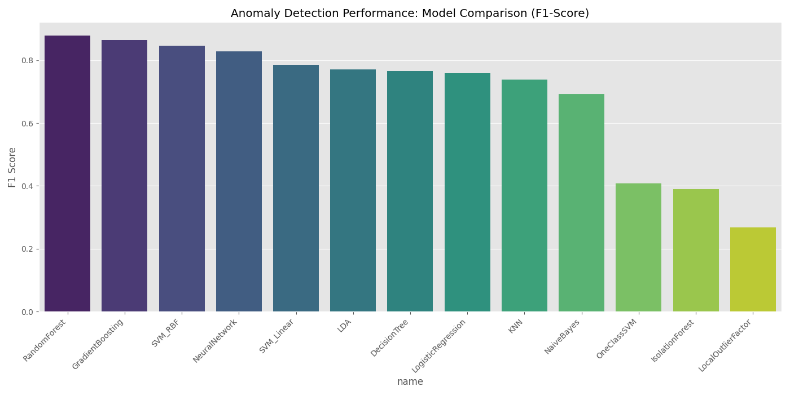
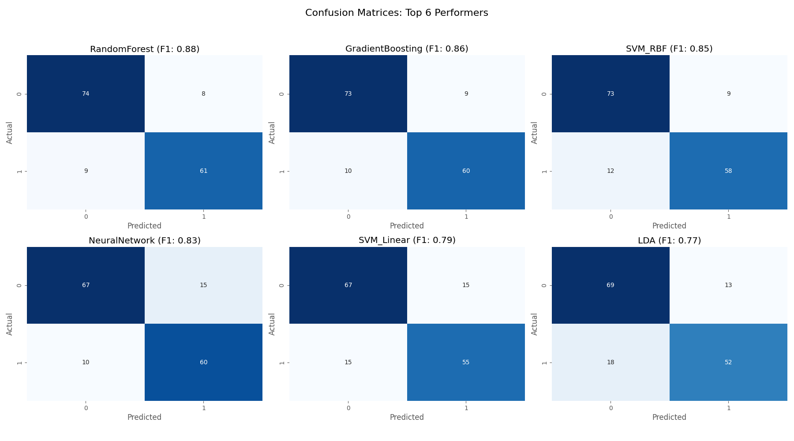
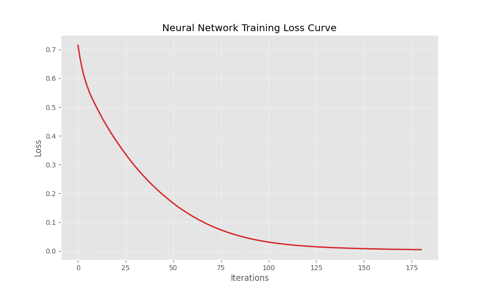

# 🏆 Anomaly Detection Leaderboard

| Rank | Model | Type | F1-Score | Accuracy | TP | TN | FP | FN | File |
| :--- | :--- | :--- | :--- | :--- | :--- | :--- | :--- | :--- | :--- |
| 🥇 | **RandomForest** | supervised | 0.8777 | 0.8882 | 61 | 74 | 8 | 9 | `archive/RandomForest.bin` |
| 🥈 | **GradientBoosting** | supervised | 0.8633 | 0.8750 | 60 | 73 | 9 | 10 | `archive/GradientBoosting.bin` |
| 🥉 | **SVM_RBF** | supervised | 0.8467 | 0.8618 | 58 | 73 | 9 | 12 | `archive/SVM_RBF.bin` |
| 4 | **NeuralNetwork** | supervised | 0.8276 | 0.8355 | 60 | 67 | 15 | 10 | `archive/NeuralNetwork.bin` |
| 5 | **SVM_Linear** | supervised | 0.7857 | 0.8026 | 55 | 67 | 15 | 15 | `archive/SVM_Linear.bin` |
| 6 | **LDA** | supervised | 0.7704 | 0.7961 | 52 | 69 | 13 | 18 | `archive/LDA.bin` |
| 7 | **DecisionTree** | supervised | 0.7647 | 0.7895 | 52 | 68 | 14 | 18 | `archive/DecisionTree.bin` |
| 8 | **LogisticRegression** | supervised | 0.7591 | 0.7829 | 52 | 67 | 15 | 18 | `archive/LogisticRegression.bin` |
| 9 | **KNN** | supervised | 0.7377 | 0.7895 | 45 | 75 | 7 | 25 | `archive/KNN.bin` |
| 10 | **NaiveBayes** | supervised | 0.6909 | 0.7763 | 38 | 80 | 2 | 32 | `archive/NaiveBayes.bin` |
| 11 | **OneClassSVM** | unsupervised | 0.4086 | 0.6382 | 19 | 78 | 4 | 51 | `archive/OneClassSVM.bin` |
| 12 | **IsolationForest** | unsupervised | 0.3908 | 0.6513 | 17 | 82 | 0 | 53 | `archive/IsolationForest.bin` |
| 13 | **LocalOutlierFactor** | unsupervised | 0.2683 | 0.6053 | 11 | 81 | 1 | 59 | `archive/LocalOutlierFactor.bin` |

### Metrics Breakdown

### Training Behavior

